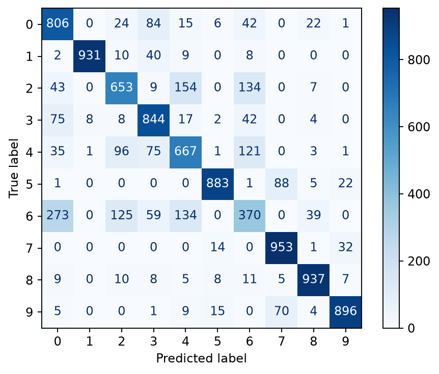
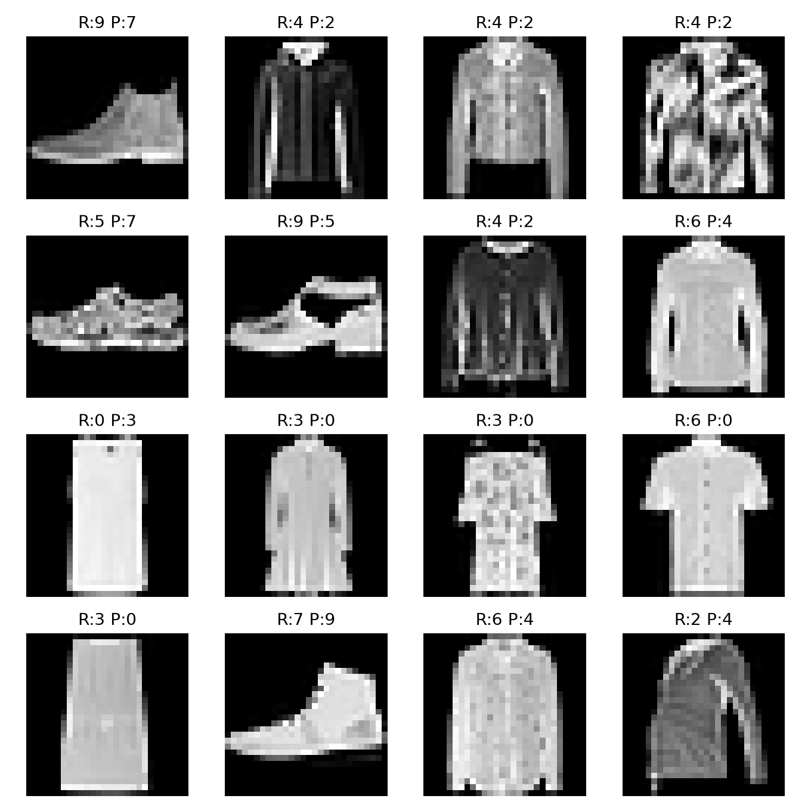

# INF-8239 · Unidad 02 · Visión computacional: CNN reproducible con Fashion-MNIST

**Asignatura:** INF-8239 Ciencia de Datos II

**Laboratorio:** U02.LAB07

**Propósito:** comparar un modelo Dense de referencia con una red neuronal convolucional (CNN) utilizando el mismo particionado de Fashion-MNIST, con evaluación predictiva y comparación de costo computacional.

## Metodología

Se utilizó Fashion-MNIST con una partición fija para garantizar una comparación reproducible entre ambos modelos.

- Entrenamiento: 54,000 imágenes.
- Validación: 6,000 imágenes.
- Prueba: 10,000 imágenes.
- Tamaño de imagen: 28x28 píxeles.
- Normalización: valores de píxeles divididos entre 255.
- Semilla utilizada: 42.
- Ejecución realizada en CPU sobre Windows.

### Modelos comparados

**Dense baseline**

Flatten de la imagen, una capa Dense de 64 neuronas con activación ReLU y una salida de 10 clases.

**CNN**

Dos bloques Conv2D + MaxPooling2D, GlobalAveragePooling2D, Dropout de 0.25 y una salida de 10 clases.

Ambos modelos fueron entrenados con Adam y entropía cruzada categórica dispersa.


## Resultados

### Comparación global

| Modelo | F1 macro | Parámetros | Entrenamiento | Inferencia por imagen |
|---|---:|---:|---:|---:|
| Dense baseline | 0.8637 | 50,890 | 8.7643 s | 0.0480 ms |
| CNN | 0.7900 | 19,466 | 77.1246 s | 0.1259 ms |

En esta ejecución, el baseline Dense obtuvo un F1 macro superior al CNN: **0.8637 frente a 0.7900**. La CNN utilizó aproximadamente 62% menos parámetros, pero presentó un mayor costo de entrenamiento e inferencia.

### Métricas por clase del CNN

| Clase | Precision | Recall | F1 |
|---:|---:|---:|---:|
| 0 | 0.645 | 0.806 | 0.717 |
| 1 | 0.990 | 0.931 | 0.960 |
| 2 | 0.705 | 0.653 | 0.678 |
| 3 | 0.754 | 0.844 | 0.796 |
| 4 | 0.660 | 0.667 | 0.664 |
| 5 | 0.950 | 0.883 | 0.916 |
| 6 | 0.508 | 0.370 | 0.428 |
| 7 | 0.854 | 0.953 | 0.901 |
| 8 | 0.917 | 0.937 | 0.927 |
| 9 | 0.934 | 0.896 | 0.915 |

La clase 6 fue la más difícil para la CNN, con **recall de 0.370 y F1 de 0.428**. Sus principales confusiones fueron las clases 0, 4 y 2; también se observaron errores hacia las clases 8 y 3.


## Evidencia visual

El entrenamiento generó evidencia gráfica para evaluar el comportamiento del modelo CNN.

### Matriz de confusión



La matriz permite identificar las clases con mayor confusión. La clase 6 presenta las principales dificultades, especialmente frente a las clases 0, 4 y 2.

### Errores de clasificación



Esta visualización muestra ejemplos de imágenes clasificadas incorrectamente y permite realizar una inspección cualitativa de los errores.

### Archivos generados

- `reports/cv_metrics.json`: métricas globales, parámetros y tiempos de ejecución.
- `reports/confusion_cnn.png`: matriz de confusión del modelo CNN.
- `reports/cnn_errors.png`: ejemplos visuales de errores.
- `models/best_cnn.keras`: modelo CNN guardado durante el entrenamiento.
- `MODEL_CARD.md`: documentación del modelo, resultados, limitaciones y criterios de uso.


## Instalación y ejecución

El proyecto utiliza `uv` para gestionar el entorno y las dependencias.

### Requisitos

- Python 3.12.
- `uv` instalado.
- Ejecución CPU en Windows.
- TensorFlow 2.21.x.

### Preparar el entorno

Desde la carpeta raíz del proyecto:

```text
uv sync --extra cpu
```

### Verificar el entorno

```text
uv run python scripts/check_runtime.py
```

La comprobación debe mostrar la versión de Python, la versión de TensorFlow y los dispositivos GPU disponibles. En esta ejecución se utilizó CPU y no se detectó GPU.

### Ejecutar las pruebas

```text
uv run pytest -q
```

### Entrenar los modelos

```text
uv run python scripts/train_cv.py --epochs 8
```

El entrenamiento genera las métricas, la matriz de confusión, los ejemplos de errores y el modelo CNN guardado.

### Resultados esperados

Después del entrenamiento deben existir:

```text
reports/cv_metrics.json
reports/confusion_cnn.png
reports/cnn_errors.png
models/best_cnn.keras
```


## Interpretación y decisión

**Resultado principal:** el baseline Dense obtuvo mejor F1 macro que la CNN en este benchmark: 0.8637 frente a 0.7900.

**Evidencia predictiva:** la CNN alcanzó un F1 macro de 0.7900. La clase 6 fue la más difícil, con recall de 0.370 y F1 de 0.428.

**Clase más difícil:** la clase 6, con principales confusiones hacia las clases 0, 4 y 2.

**Costo comparado:** la CNN utilizó aproximadamente 62% menos parámetros, pero tardó más en entrenarse y presentó mayor tiempo de inferencia por imagen.

**¿La mejora justifica el costo?:** no en esta ejecución. La CNN no mejoró el F1 macro respecto al baseline y tuvo mayor costo temporal.

**Limitación del benchmark:** Fashion-MNIST es un conjunto de imágenes pequeñas y controladas; estos resultados no garantizan el mismo comportamiento en imágenes reales u otros dominios.

**Decisión antes de usar otro dominio:** validar nuevamente con datos representativos del nuevo dominio, comparar contra un baseline y revisar métricas por clase, matriz de confusión y errores.

## Green AI y costo computacional

El experimento incorpora una comparación explícita entre desempeño predictivo y costo computacional.

- Se ejecutó en CPU, sin GPU.
- Se registró el tiempo de entrenamiento de ambos modelos.
- Se registró el tiempo de inferencia por imagen.
- Se comparó el número de parámetros.
- La CNN redujo el número de parámetros, pero no produjo una mejora predictiva en esta ejecución.

Por tanto, para este benchmark el modelo Dense presenta una relación desempeño/costo más favorable. La selección de una arquitectura más compleja debe justificarse con una mejora predictiva que compense su costo adicional.

## Limitaciones

- El benchmark utiliza exclusivamente Fashion-MNIST.
- La evaluación corresponde a una partición fija y a una ejecución concreta.
- No se debe asumir generalización a imágenes reales sin una validación adicional.
- La CNN presenta dificultades importantes en la clase 6.
- La ausencia de GPU limita la comparación con escenarios acelerados por hardware especializado.

## Uso de herramientas de IA

Se utilizó ChatGPT como herramienta de asistencia durante el desarrollo del laboratorio.

La asistencia se utilizó principalmente para:

- Interpretar los requisitos del laboratorio y la rúbrica.
- Revisar la estructura del proyecto y la reproducibilidad.
- Proponer y revisar documentación técnica.
- Analizar resultados obtenidos por los scripts.
- Detectar inconsistencias y errores en archivos de documentación.

Las decisiones finales, ejecución del código, pruebas, entrenamiento de los modelos, generación de métricas y revisión de los archivos fueron verificadas localmente en el entorno del proyecto.

Los resultados reportados en este README no fueron asumidos a partir de la asistencia de IA: fueron obtenidos mediante la ejecución del código del proyecto y posteriormente comprobados.

## Pruebas

Las pruebas automatizadas verifican el preprocesamiento de imágenes y el contrato de salida del modelo CNN.

Comando utilizado:

```text
uv run pytest -q
```

Resultado final verificado: **3 pruebas aprobadas en 4.99 s**.

